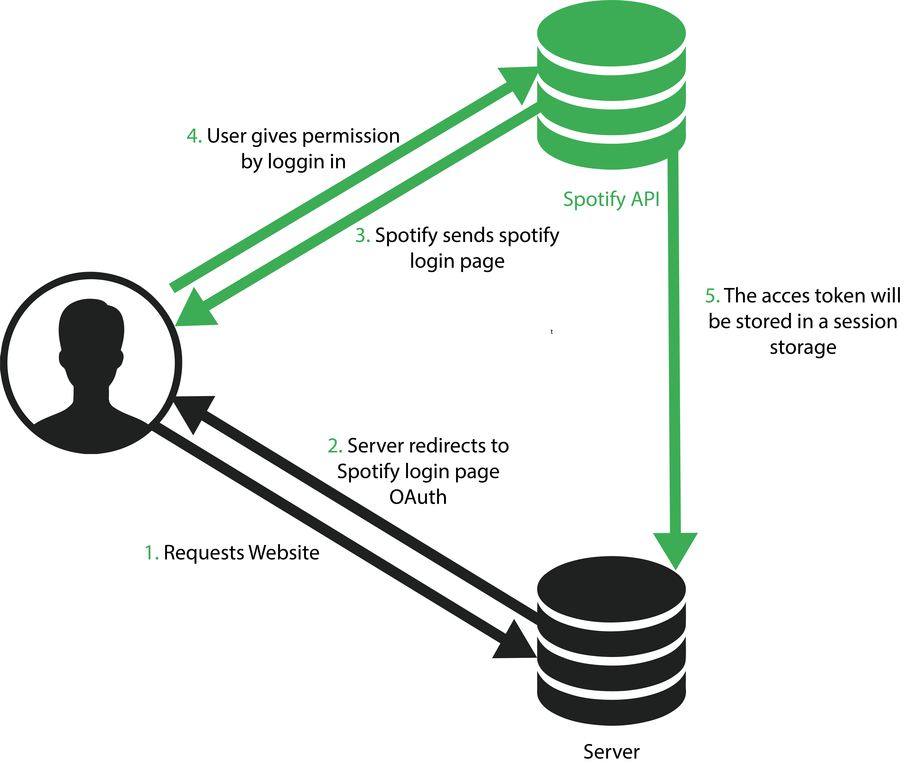
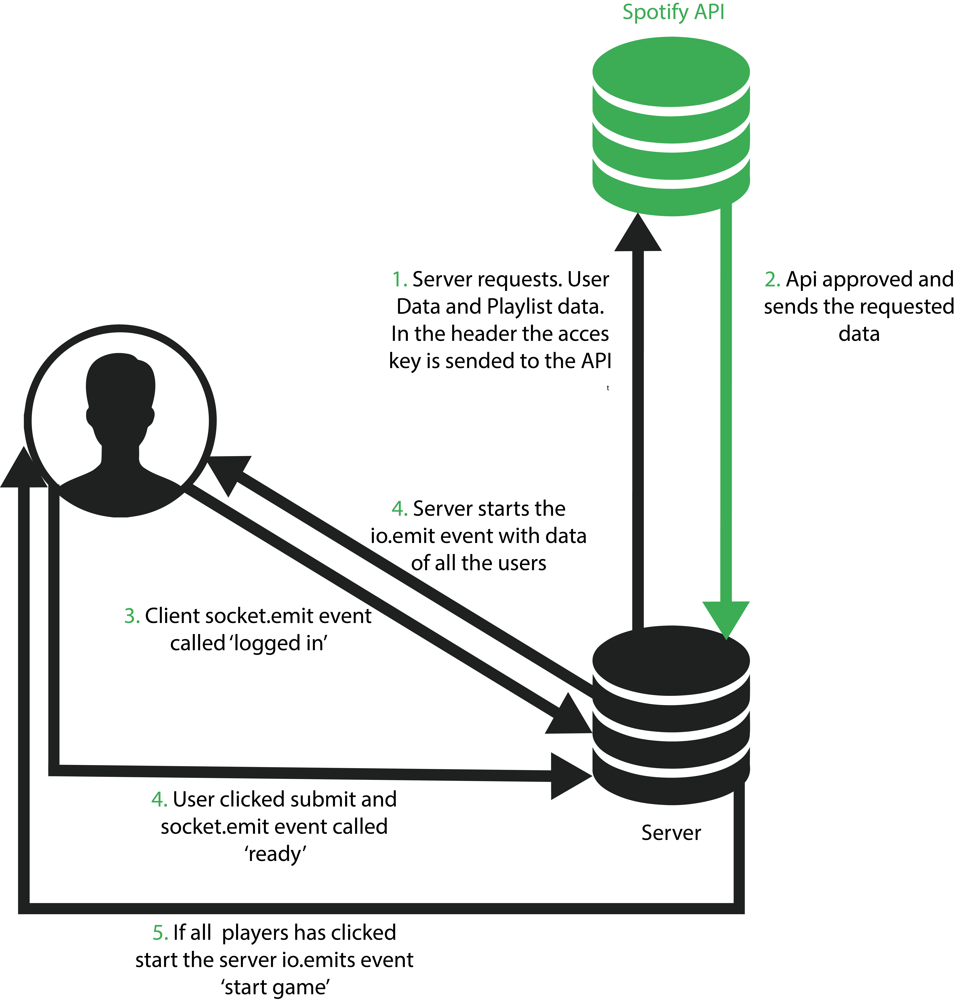
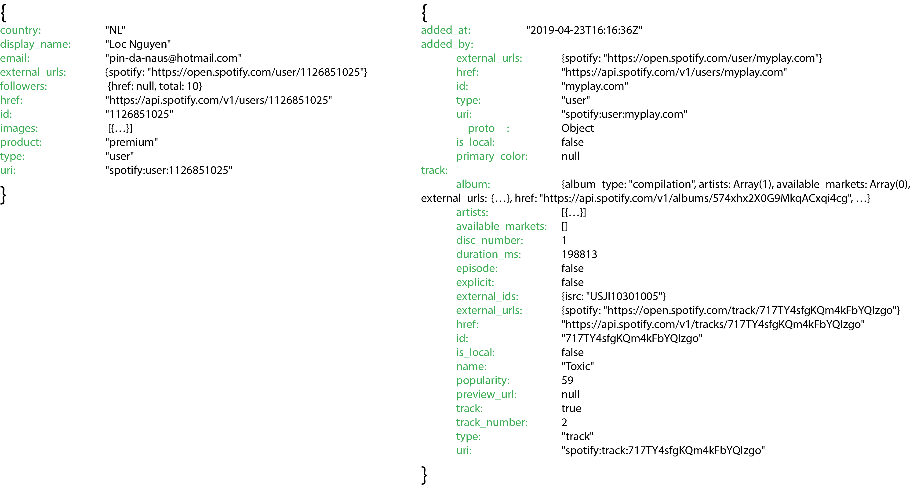
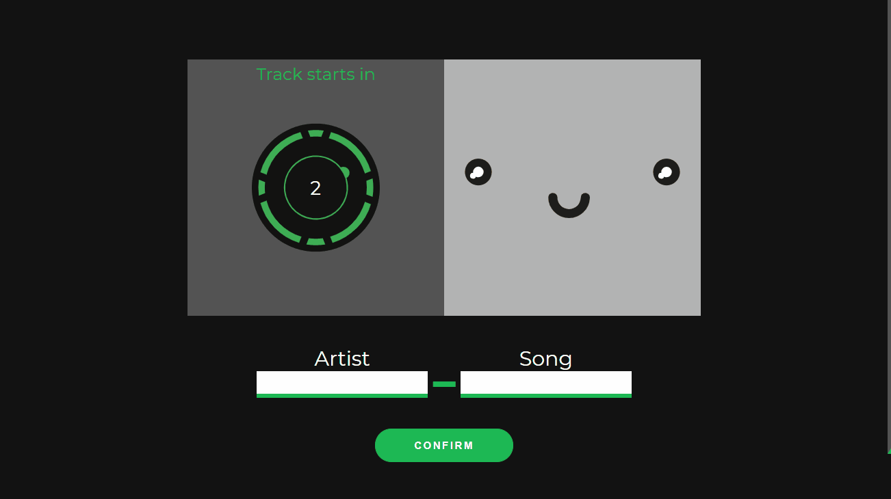
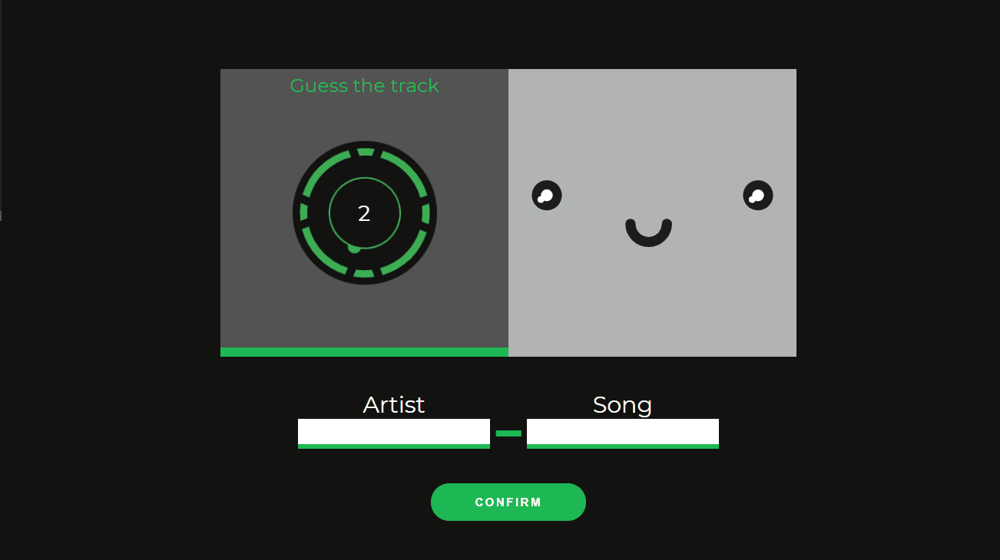

# Spotify Game
A game which the players have guess the song. The first person who has guessed the song wins the most points. Every track will be played for roughly 5 seconds. After that the players have 15 seconds to guess the artist name and song name of the track that has played. The games play's 10 songs till the game is finished. 


## Table of Contents
* [Installing](#installing-)
* [First Drawning](#first-drawning-)
* [API](#api-)
    * [OAuth Api](#oauth-api)
* [Data Flow](#data-flow)
    * [OAuth](#oauth)
    * [Waiting Room](#waiting-room)
* [Game Instructions](#game-instructions-)
    * [Begin Screen](#begin-screen)
    * [Waiting room](#waiting-room)
    * [Game Interface](#game-interface)
* [To Do List](#to-do-list-)

## Installing 
Instructions:
```
git clone

npm install

npm run start

https://localhost:3000
```
## First Drawning
This is my first drawning of the application. The drawning is a the actual game screen. 


## API
For this application i have used the Spotify API.

I use the Spotify to get the following data:

* Track:
    * Artist-Name
    * Song-Name
    * MP3-Preview-url
* User:
    * Users Name
    * Users Profile picture

### OAuth Api
In order to get data from the api the user has to grant acces to their spotify account's data. This will be done through OAuth. After the user has logged in via Spofity, the server will receive an acces token. This token is needed in order to fetch data form the Spotify Api

## Data flow
The data flow of this applications is been split into three parts:
*   OAuth
*   Waiting Room
*   Game

### OAuth
The user needs to login via OAuth with Spotify
1.  User requests website
2.  Server respond with a static html page which have a login button where the user will be redirected to the spotify login page (for authenitication)
3.  Spotify server sends login page.
4.  User gives persmission by loggin in with his/her credentials in the spotify website
5.  The acces token will be sended via a post method to the server. The acces token will be saved in the session storage


### Waiting Room
This is the waiting room before the game starts. All the players that wants to play the game need to collect in the waiting room. For the game the to start all the players in the room needs to click on ready.
1.  Server request data from the spotify api with the acces token. The server asks for the users data an playlist data.
2.  Api approved the requests and sends the data that has been requested. All the data will be stored in the server until the client asks for some or all of the data.
3.  Client scripts sends automatic a socket event called `logged in`
4.  Server reacts at the event `logged in` with a io.emit event called `fill waiting room`
5.  If an player clicks the ready btn an socket event will be triggerd called ready `ready`. If all the players has clicked ready the server will send an io.emit event called `start game`


<details>
<summary>Click here to see the data that we get from Spotify</summary>

Unformatted Requested Data from Spotify


Formated data will look like this:
```js
user     =   {
                 socketId,
                 name,
                 imageUrl
             }

playlist =  {
                preview_url,
                artist,
                albumImg,
                songName
            }
```
</details>

### Game
In the game screen all the data has been stored in the server so it isnt realy usefull to make a diagram of the data flow in this state of the application. So thats why i have made a script flow instead, to see how the application runs with all the functions inside.

## Game Instructions
Here you can find the instructions of the application from start to end
### Begin Screen
On the landing page the websites ask the user to login with his/her Spotify account. I made the landing page very inviting for the user to login so it wouldn't be a basic login screen.


### Waiting room
In this page the user has to wait(or not) for other players to enter the game. The player can play by his/herself by clicking on the `IM READY` button before anyone enters the waiting room. If a player is barely visible that means that they didn't clicked the `IM READY` button yet.


### Game Interface
When every player in the waiting room has clicked on the `IM READY` button then the game interface will load. In this screen the player has to wait till the countdown is till zero before the first track will start. While the music is playing there will be a little animation playing for a visual clue that the track has started or is playing.


After the preview of the track the user gets 15s to guess the artist name and the song name of te track. After the 15s the track will be revealed and the user cant give his/her answwer anymore. And the results will be displayed right after the reveal. Every track that was played untill now will be displayed on the rightside of the interface

The answer will be compared without spaces and special characters. These are the special characters that will be ignored
```js
const allChar = ['(', ')', '.', '!', '*', ' ', ',']
```



#### Points System
| Points | Guessed |
|--------|:-------------:|
| 1000   |     Artist And Song     |
| 500    |     Song or Artist    |
| 0      |     nothing     |


## To Do List
- [ ] Make socket.rooms for x amount of players
- [ ] Better answer comparison system (Dont count the space as answer)
- [ ] Handle the buggs (sometimes a weird bug occures)
- [ ] Mobile responsive
- [ ] Dynamically load playlist(player can choose)
- [ ] Settings for room (time etc.)
- [ ] Put more comments
- [ ] Functions WireFlow maken
- [ ] Rubriek bekijken
- [ ] Rubriek aanvulling geven.