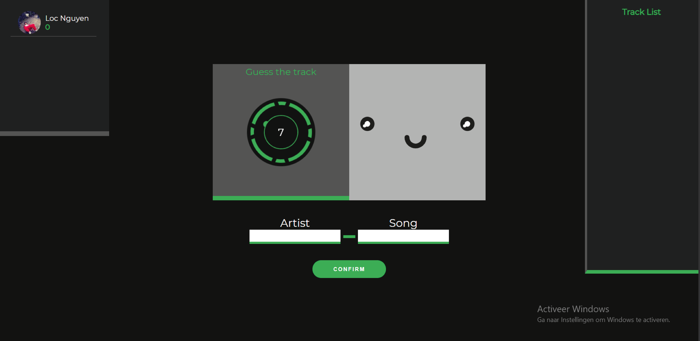
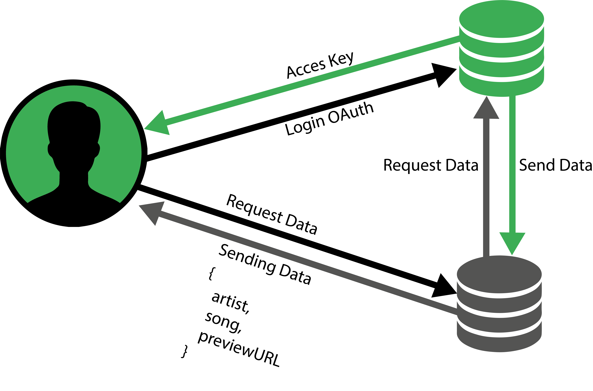
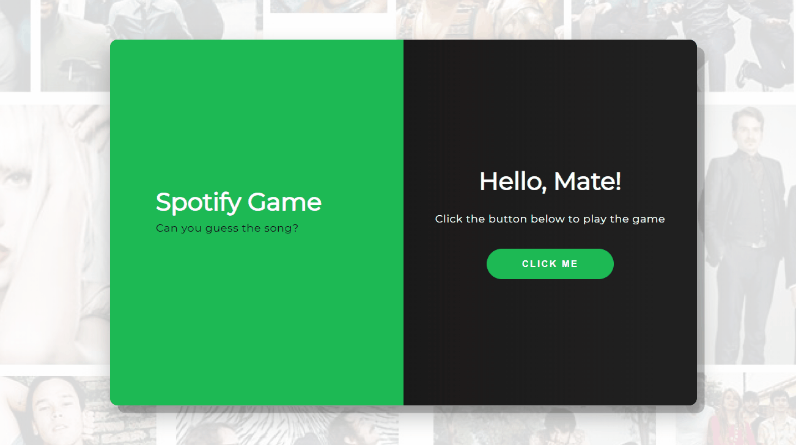
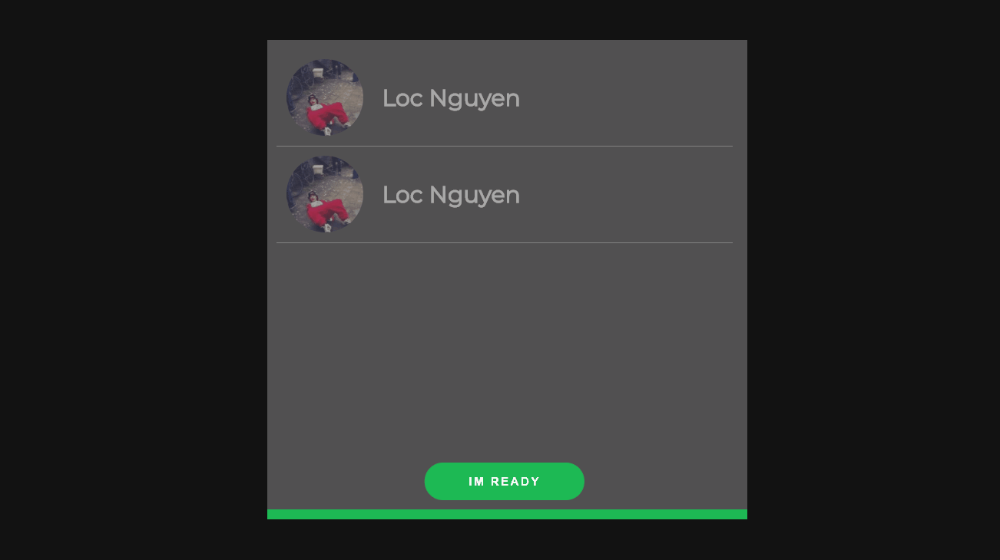

# Spotify Game
A game which the players have guess the song. The first person who has guessed the song wins the most points. Every track will be played for roughly 5 seconds. After that the players have 15 seconds to guess the artist name and song name of the track that has played. The games play's 10 songs till the game is finished. 



## Table of Contents
* [Installing](#installing-)
* [First Drawning](#first-drawning-)
* [API](#api-)
    * [OAuth](#oauth)
    * [Data Flow](#data-flow)

## Installing 
Instructions:
```
git clone

npm install

npm run start

https://localhost:3000
```
## First Drawning
This is my first drawning of the application. The drawning is a the actual game screen. 


## API
For this application i have used the Spotify API.

I use the Spotify to get the following data:
* Track:
    * Artist-Name
    * Song-Name
    * MP3-Preview-url
* User:
    * Users Name
    * Users Profile picture

### OAuth
In order to get data from the api the user has to grant acces to their spotify account's data. This will be done through OAuth. After the user has logged in via Spofity, the server will receive an acces token. This token is needed in order to fetch data form the Spotify Api

## Data flow



## Game Instructions
Here you can find the instructions of the application from start to end
### Begin Screen
On the landing page the websites ask the user to login with his/her Spotify account. I made the landing page very inviting for the user to login so it wouldn't be a basic login screen.


### Waiting room
In this page the user has to wait(or not) for other players to enter the game. The player can play by his/herself by clicking on the `IM READY` button before anyone enters the waiting room. If a player is barely visible that means that they didn't clicked the `IM READY` button yet.

##

| Points | Order guessed |
|--------|:-------------:|
| 1000   |     First     |
| 900    |     Second    |
| 800    |     Third     |


## Feedback
Dont know yet