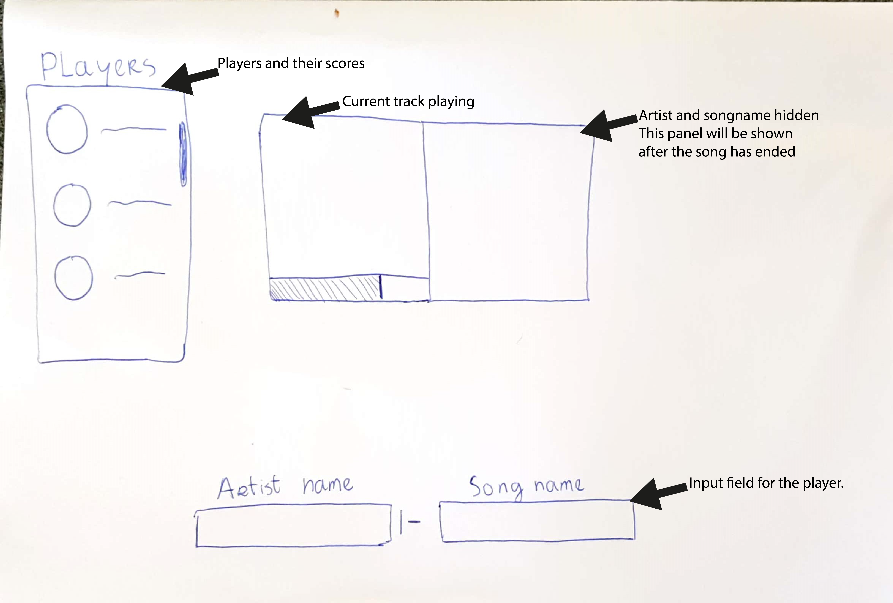
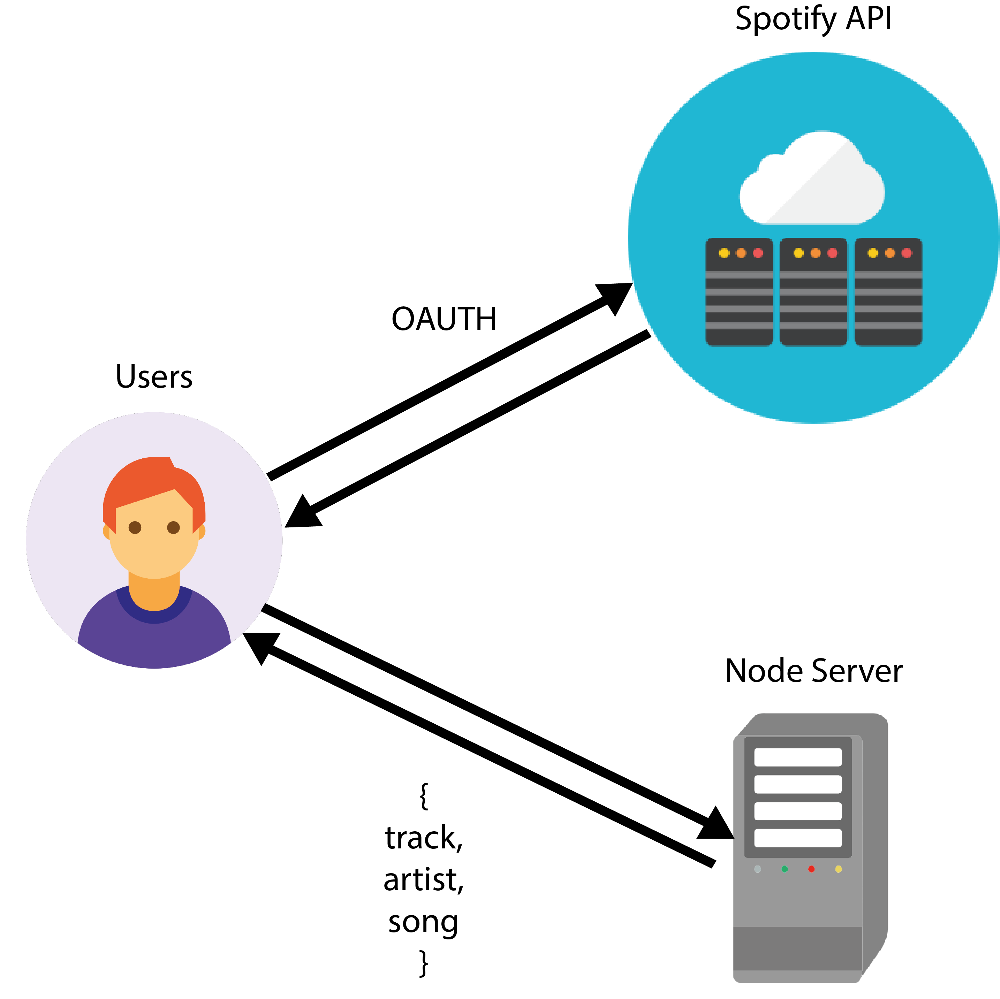

# Spotify Game
A game which the players have guess the song. The first person who has guessed the song wins the round. Every game has 10 rounds.
The songs are generated by the Spotify api in the playlist Top 2000 songs of all time. The player who first guessed the song gets the most points. See below how the points system works.

**Getting Points:** Who guessed the song first gets 1000 points second 900 third and so on. Basic right?

| Points | Order guessed |
|--------|:-------------:|
| 1000   |     First     |
| 900    |     Second    |
| 800    |     Third     |

## First Drawning
This is my first drawning of the application. The drawning is a the actual game screen. 

## Spotify API
## Data flow

### OAuth
In order to get data from the api the user has to grant acces to their spotify account's data. This will be done thourgh OAuth. 

## Feedback
Dont know yet